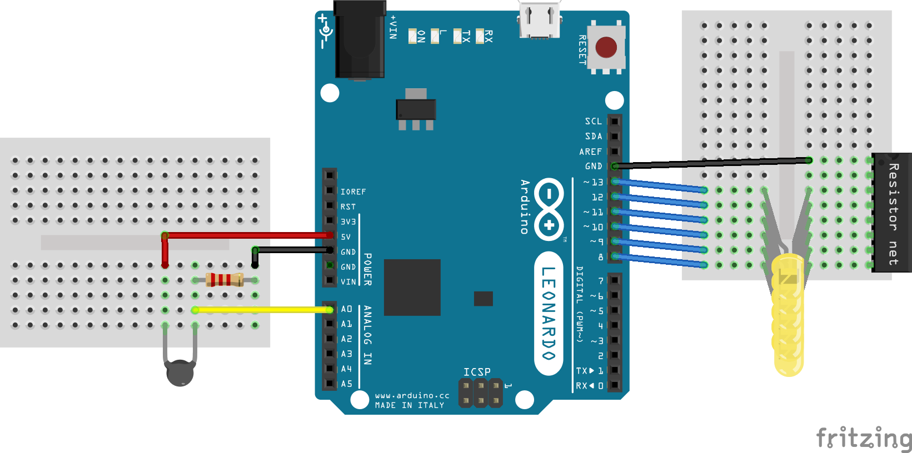

# Varma handen

Använd en termoresistor för att mäta temperaturskillnader. Detta projektet lånar tekniker både från nattugglan och slumpen.

## Tekniker

* Arduino
* For-loopar
* Analog mätning
* Spänningsdelning
* Linjära ekvationer

## Komponentlista

* 1x Arduino (Uno eller Leonardo)
* 1x Kopplingsplatta (breadboard)
* 6x LED (valfri färg)
* 1x Resistorskena ~300 Ohm
* 1x Resistor 2.5k Ohm
* 1x Termistor (termoresistor)
* ~10x kopplingskabel

## Bygge

Ritningen visar två kopplingsplattor, men det går lika bra att ha allt på samma. Det är lättare att se vad som tillhör vilken krets på ritningen.

Kom ihåg att långa benet på LEDen ska kopplas mot arduinon. Den stora svarta komponenten är gul i verkligheten och inte lika stor.

## Kod del 1

Börja med att mäta temperaturen i rummet och när du håller i termoresistorn.
Skriv koden, kör programmet och öppna __Serial Monitor__, skriv upp vilka siffror du får.

    int temp;

    void setup() {
      Serial.begin(9600);
    }

    void loop() {
      temp = analogRead(0);

      Serial.println(temp);
    }

## Kod del 2

Nu ska vi få alla LEDs att lysa, för att se om de är korrekt kopplade.

__Ändra__ koden du skrev innan så att den ser ut såhär:

    int temp;

    void setup() {
      Serial.begin(9600);

      for(int i=8; i<=13; i++) {
        pinMode(i, OUTPUT);
      }
    }

    void loop() {
      temp = analogRead(0);
      Serial.println(temp);

      for(int i=8; i<=13; i++) {
        digitalWrite(i, HIGH);
      }
    }

Kör koden och se till att alla LEDs lyser, ändra på kopplingen om något är fel.

## Kod del 3

Nu ska temperaturen kopplas ihop med lysdioderna. Tanken är att alla dioder ska lysa när du värmer termoresistorn med handen, och ingen ska lysa när termoresistorn är så varm som luften i rummet. Är den någonstans mittemellan så ska några dioder lysa.

Vi behöver en variabel som talar om hur många LEDs som ska lysa. Siffrorna vi kan läsa från termoresistorn passar inte riktigt mellan 0 och 6, så därför måste vi använda en matematisk algoritm!

Vi behöver hjälpsiffrorna från dina mätningar innan, den kalla siffran får heta `low` och den varma får heta `high`. `low` är alltså värdet från när temperatursensorn är lika varm som rummet, och `high` är din hands värme. I mitt exempel är `low` 500, och `high` 582.

Ta värdet `temp` från termoresistorn minus `low`, då kan `temp` vara 0 -- 82, vi vill att den ska vara 0 -- 6. Ta därför `(temp - low)` gånger 6, och dela sedan allt med `(high - low)` som i mitt fall är 82, då blir det ungefär såhär:

    500 -- 582 => 0 -- 82 => 0*6 -- 82*6 => 0*6/82 -- 6 => 0 -- 6

Då har vi förvandlat `temp` från att vara mellan 500 och 582 till att vara mellan 0 och 6. Spara svaret till variabeln `level`. Koden är nästan enklare att förstå än siffrorna!

    level = ((temp - low) * 6) / (high - low);

Vad som mer ska hända är att varje gång `loop()` körs så ska vi släcka alla LEDs och direkt tända så många som siffran `level` är.

__Ändra__ i din kod så att den ser ut såhär:

    int temp;
    int high = 582;
    int low = 500;
    int level;

    void setup() {
      Serial.begin(9600);

      for(int i=8; i<=13; i++) {
        pinMode(i, OUTPUT);
      }
    }

    void loop() {
      temp = analogRead(0);
      Serial.println(temp);

      level = ((temp - low) * 6) / (high - low);

      for(int i=8; i<=13; i++) {
        digitalWrite(i, LOW);
      }

      for(int i=8; i<= 7 + level; i++) {
        digitalWrite(i, HIGH);
      }
    }
